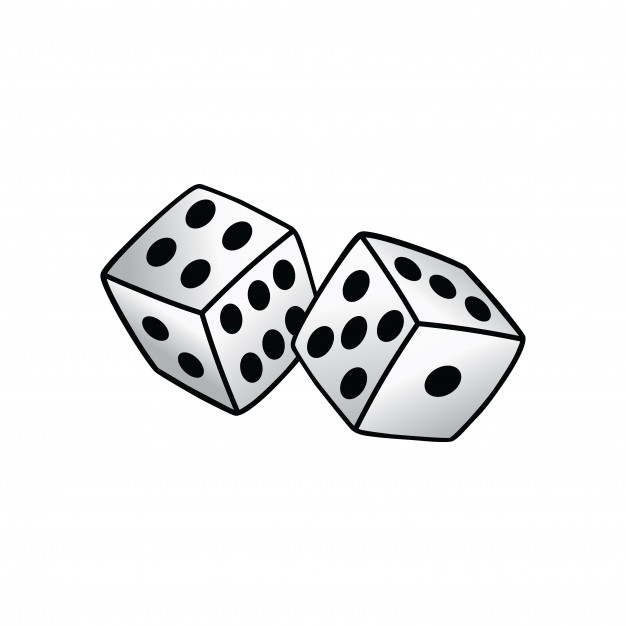
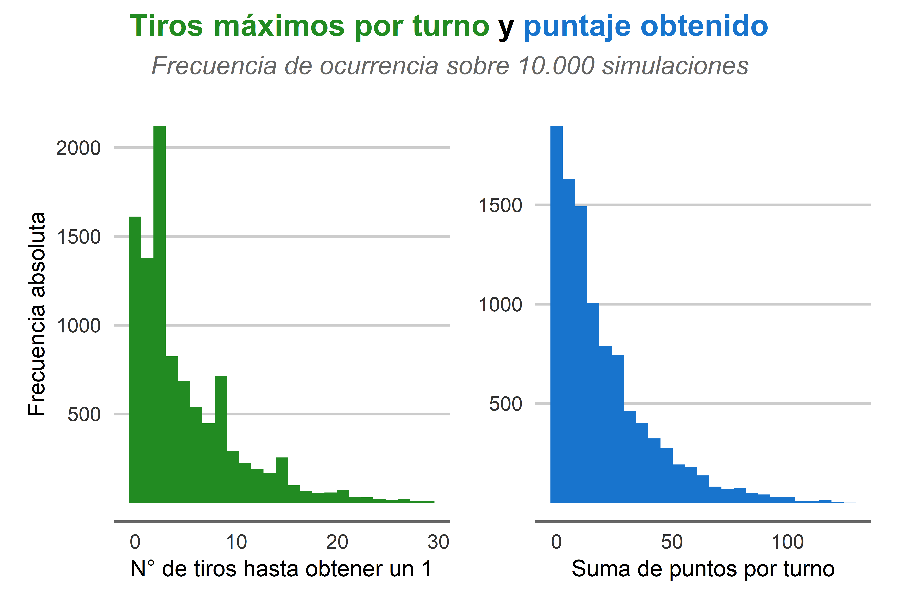
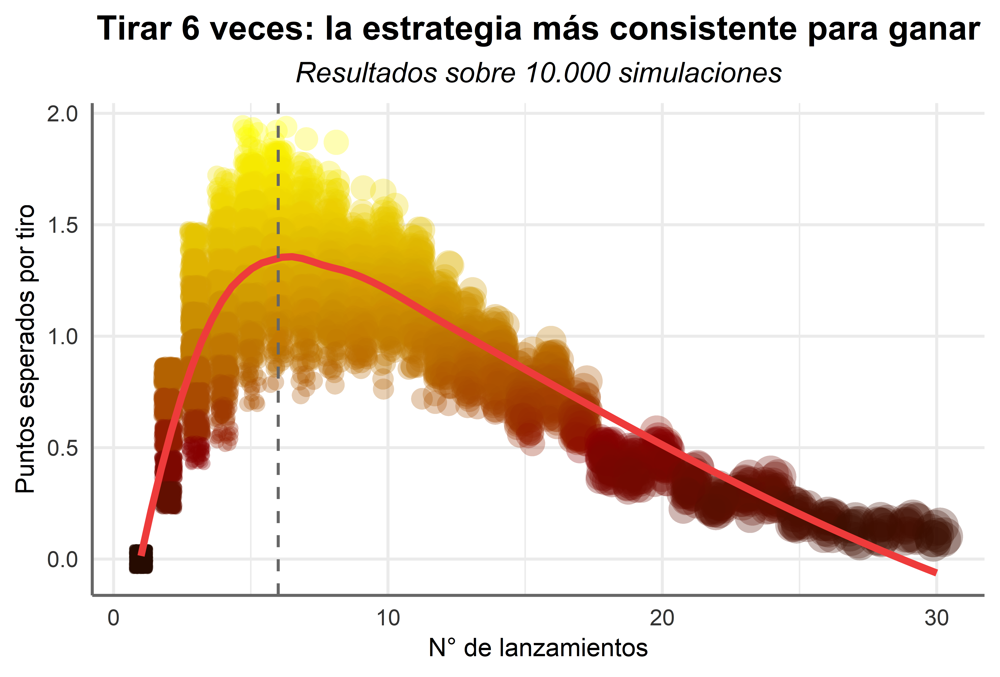

<h1 align="center"> Simulación del juego de azar "El ambicioso"</h1>

El ambicioso es un juego de dados por turnos, en el que gana el jugador que primero llega o pasa los **101 puntos**, sumando los puntos de sus tiradas. Por ejemplo: si el primer jugador tira un **6 y después un 2** tendrá **8 puntos**. Se juega con sólo un dado y las reglas son muy sencillas:

- El primer jugador tira el dado. Después de hacer una tirada, cada jugador decide si terminar su turno o seguir tirando.
- Si el jugador termina su turno, los puntos que sumó se acumularán para el siguiente turno. Le toca al siguiente jugador.
- Si el jugador tira y obtiene un 1, se borrarán todos los puntos obtenidos durante el turno en curso. Le toca al siguiente jugador.
- Cada jugador debe tener la misma cantidad de turnos. Esta regla es para anular la ventaja de tener el primer tiro.

## Ejemplo 

1. Ana tira 4, 6, 3, 3, 2 = <b style='color:#008000;'>18</b> puntos. Termina su turno voluntariamente.
2. Jorge tira 2, 2, 6, 5, 2, 4, <b style='color:#FF0000;'>1</b> = 0 puntos. Termina su turno por obligación. 
3. Ana tira 5, 2, <b style='color:#FF0000;'>1</b> = 0 puntos + 18 que guardó = <b style='color:#008000;'>18</b> puntos. Termina su turno por obligación.
4. Jorge tira 5, 6 = <b style='color:#008000;'>11</b> puntos. Termina su turno voluntariamente.

... Finalmente, Ana tiene 98 puntos y obtiene un 4, decide plantarse en 102 puntos. Como ella comenzó, Jorge todavía tiene un turno para superarla.

## Simulación

Entremos al grueso del asunto. El elemento básico del juego es la tirada de un dado de seis caras, que se puede ver como un proceso estocástico. Como se sabe, la tirada de un dado se puede modelar como una variable aleatoria que sigue la distribución uniforme discreta con .

La idea principal de este proyecto es aprovechar que la tirada del dado es un evento repetible y usar la [Ley de los grandes números](https://es.wikipedia.org/wiki/Ley_de_los_grandes_números), junto con el lenguage de programación `R` para simular miles turnos del juego y encontrar la *cantidad óptima de tiradas* que maximiza las chances de ganar al juego.

> *Otro enfoque para resolver este problema es la vía matemática. Tal vez ataque al problema de ésta forma en el futuro próximo.*

Para este proyecto probé con 1.000 y 10.000 **simulaciones de turnos**, obteniendo resultados similares (multiplicar por 10 las simulaciones ralentiza mucho la producción de gráficos y los resultados no varían de 10.000 en adelante). Lo que verán a continuación es el segundo caso.

Los histogramas son consistentes con la intuición, muchas veces podremos tirar el dado impunemente durante 3, 4 o 5 turnos hasta obtener un 1, y pocas veces podremos hacer 30 tiradas al hilo. En este caso, he tenido que excluir datos improbables del gráfico, ¡o el de suma de puntos se extendería hasta 242!

### Algunas estadísticas

- El **95% de las veces podremos tirar el dado hasta 16 veces** sin encontrarnos un 1.
- Tras 16 tiros exitosos, obtendremos en promedio **60 puntos**.
- El 50% de las veces obtendremos **más de 13 puntos**.
- El 90% de las veces obtendremos **48 puntos o menos**.
- ¡**47 veces** se ganó el juego en un turno! Esto es el 0,5% de las veces (1 en 200).
- El 16,19% de las veces el jugador tiró un 1 en su primer tirada, lo que está muy cerca del valor real, de 16,67%. Tamaños muestrales mayores (y mejores computadores) ayudarían a disminuir esta brecha.

## Encontrando una estrategia ganadora

Tortuga o liebre, volátil o estable, riesgo o seguridad... Ya conocemos las dos grandes fuerzas que están en pugna en este juego: el *N° de tiradas* y los *puntos obtenidos*. Es lógico pensar (y matemáticamente correcto) que mientras más tiradas realice, más puntos podré sumar. También es lógico pensar que mientras más veces tire el dado, más estaré tentando a la suerte y tarde o temprano obtendré un 1 (también es matemáticamente correcto). Por tanto, estamos frente a un dilema: ¿deseamos **arriesgar mucho para ganar rápido** o **arriesgar poco pero sumar seguro**?

Como he dicho antes, este problema se puede resolver con matemáticas, pero aprovecharemos el dataset de 10.000 simulaciones disponible [aquí](data.csv).

Digamos que un jugador de bar nos engatuza para participar en su juego, donde tenemos que elegir una de tres tazas. Bajo una de ellas hay una polca. Si elegimos la taza que contiene la polca, ganaremos $1.500, pero si nos equivocamos tendremos que pagar $900. El dinero que esperamos ganar o perder si jugamos los matemáticos lo han definido . 

Análogamente, podemos definir el el valor esperado o esperanza matemática de nuestro problema como sigue:

Donde  es el turno en que se ha tirado el dado  veces. El objetivo es encontrar un  que maximice la esperanza. En nuestro modelo, la probabilidad de ocurrencia de  estará dada por su frecuencia relativa.
¡Suficientes matemáticas! Vamos a materializarlo mediante una visualización. 

